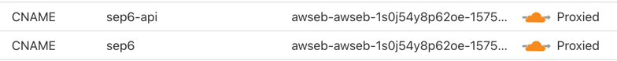
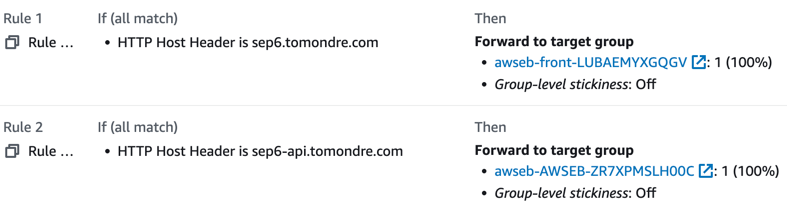
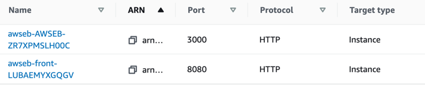
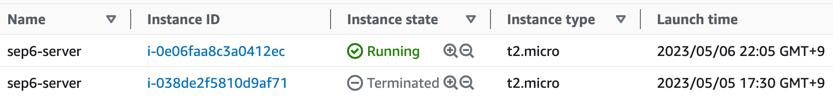

# Cloud provider
AWS

# Architecture diagram

# Hosting Service
Elastic Beanstalk

# Client request flow components

## DNS Domain

The first entry-point from the client's perspective is a DNS domain. Two domains have been created for each service (backend, frontend) in Cloudflare that point to the load balancer of our infrastructure:
1. sep6.tomondre.com for the frontend service 
2. sep6-api.tomondre.com for the backend service

[//]: # (Write what are the benefits of dns records - user-friendly domains and a need for differenciating between the two services for the later-mentioned listeners)

## Load Balancer rules
After a client request arrives at a load balancer, load balancer rules are evaluated in order to load balance the traffic to the correct target.
Two rules and one default catch-all have been created to ensure that the traffic ends up in the correct destination:

Each of the rules matches the host header of the request that contains the DNS record called by the client. After the rules are evaluated, the traffic is forwarded to the respective target group.

## Target Group
A target group is essentially an AWS resource that allows routing requests to one or more registered targets.
In our infrastructure, the target groups are used to direct traffic to virtual machine instances running our two services on a specific port.

## Services
Each service is running on instances listening on a specific port. After a request is forwarded by the target group to the ports,
the service processes it and returns the result.

# Handling deployments
By default, Elastic Beanstalk is configured to use all-at-once deployments, which means that the service is deployed to
all instances simultaneously. This may result in downtime - a period of time during which the service is not running and therefore is not able to respond to requests.
To avoid this situation, the strategy has been changed to rolling with additional batch. It allows deploying a new
version of service code without any downtime and reducing capacity. The new version of the service
is first deployed to a new instance simultaneously with the old one. When it's up and running, the traffic is shifted from the old
instance to the new one, and the old instance is terminated.

# Docker compose

A Docker Compose file is used as an entry-point for Docker running in Elastic Beanstalk to instruct what configuration is desired to run on the machine.
Two services are configured to be run on the machine:

* Frontend
* Backend

Each service contains the URL of its corresponding Docker image and the respective port mapping of the Docker containers to the ports of the host (EC2).

When a new version needs to be deployed, the command called `aws elasticbeanstalk update-environment` needs to be run to refresh the docker-compose.yml file inside the hosting server/VM. This way, the Docker daemon pulls and runs the updated Docker image with the `:latest` tag.

# Service URLs
* Frontend - https://sep6.tomondre.com
* Backend - https://sep6-api.tomondre.com
